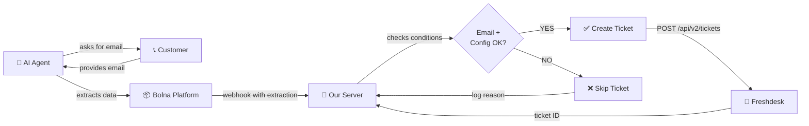

# Freshdesk Support Ticket Auto-Creation - Setup Summary

## 🎯 What's Working

✅ **Freshdesk Configuration**
- Agent `a7487186-b053-4ae2-b98e-2fe97bae6a30` has Freshdesk enabled
- Domain: `augmont`
- API key is set

✅ **Webhook Handler**
- System listening for call completion webhooks
- Automatically processes call data
- Enhanced logging shows exactly why tickets are/aren't created

✅ **API Endpoints**
- **Check config:** `GET /api/agent-configs/:agentId`
- **Diagnostic:** `GET /api/agent-configs/:agentId/diagnostic` ← **NEW**
- **Update config:** `PUT /api/agent-configs/:agentId`

---

## ❌ What's Missing

The AI agent is **NOT extracting the customer's email** from calls.

**Result:** No ticket is created because `support_email` is missing.

### Current Logs (Last Calls)
```
Call #21 (2026-04-02):
   - support_email: ❌ NOT FOUND
   - support_phone: ℹ️  optional
   - agent_id: ✅ a7487186-b053-4ae2-b98e-2fe97bae6a30
   ⚠️  SKIPPING: No support_email extracted
```

---

## 🔧 What Needs to be Done

### Step 1: Update Agent's System Prompt (Bolna Platform)

Go to **https://platform.bolna.ai/agents** and edit agent `a7487186-b053-4ae2-b98e-2fe97bae6a30`

**Add this to the system prompt:**

```
When the user mentions they need support or have an issue:

1. Show empathy and acknowledge their problem
2. Ask for their email: "May I please have your email address so we can help you better?"
3. Wait for their response and confirm it
4. Extract this information and return it at the end of the call in this JSON format:

{
  "support_email": "<customer_email>",
  "support_phone": "<customer_phone>",
  "issue_type": "<brief issue category>",
  "issue_summary": "<2-3 sentence summary of the issue>"
}

This JSON MUST be returned in the 'agent_extraction' field so a support ticket is automatically created.
```

### Step 2: Test the Flow

1. **Trigger a test call:**
   ```bash
   curl -X POST http://localhost:3000/api/calls/trigger \
     -H "Content-Type: application/json" \
     -d '{
       "agentId": "a7487186-b053-4ae2-b98e-2fe97bae6a30",
       "phoneNumber": "+919876543210",
       "purpose": "test_support"
     }'
   ```

2. **When AI asks for email:** Provide a test email like `test@example.com`

3. **Check the call record:**
   ```bash
   curl http://localhost:3000/api/calls | grep -i freshdesk_ticket
   ```

4. **Expected result:**
   - `freshdesk_ticket` field contains ticket ID ✅

---

## 📊 How It Works (End-to-End)



---

## 🔍 Monitoring & Diagnostics

### Real-Time Logs
Watch server logs for Freshdesk ticket creation:
```bash
tail -f /tmp/server.log | grep -i freshdesk
```

### Check Agent Configuration
```bash
curl http://localhost:3000/api/agent-configs/a7487186-b053-4ae2-b98e-2fe97bae6a30/diagnostic
```

### Sample Output
```json
{
  "freshdeskConfigured": true,
  "checks": {
    "freshdesk_enabled": "✅ Freshdesk enabled",
    "freshdesk_domain": "✅ Domain set: augmont",
    "freshdesk_api_key": "✅ API key configured"
  },
  "nextSteps": [
    "✅ Agent is ready for Freshdesk tickets",
    "📝 Agent must extract support_email during calls",
    "💡 Update agent system prompt to ask for email"
  ]
}
```

---

## 📋 Conditions Required for Ticket Creation

All 3 must be true:

| Condition | Current Status | Source |
|-----------|:----------:|---------|
| **Agent has Freshdesk enabled** | ✅ Yes | `agent_configs.freshdesk_enabled = true` |
| **Agent has Freshdesk domain** | ✅ Yes (augmont) | `agent_configs.freshdesk_domain = 'augmont'` |
| **Agent has Freshdesk API key** | ✅ Yes | `agent_configs.freshdesk_api_key = [set]` |
| **Call has support_email extracted** | ❌ **Missing** | `agent_extraction.support_email` from Bolna |
| **Call has agent_id** | ✅ Yes | Auto-populated |

---

## 📞 Example: What Happens When All Conditions Are Met

### Call Transcript (Hypothetical)
```
assistant: Hi, this is Esha. How can I help you today?
user: I'm not able to login and my app is crashing frequently
assistant: I'm sorry to hear that. I can help you create a support ticket.
           May I please have your email address so our team can reach you?
user: sure, it's john.doe@example.com
assistant: Thank you, John. I've logged your issue. A support ticket will be
           created and our team will contact you at john.doe@example.com shortly.
```

### Agent Extraction (Returned to Bolna)
```json
{
  "support_email": "john.doe@example.com",
  "support_phone": "+919876543210",
  "issue_type": "app_crash",
  "issue_summary": "User unable to login, app crashes frequently"
}
```

### Freshdesk Ticket Created
- **Ticket ID:** 12345
- **Email:** john.doe@example.com
- **Subject:** Support Request via Voice Call
- **Description:** User unable to login, app crashes frequently
- **Status:** Open
- **Priority:** Medium
- **Tags:** `voice-call`, `bolna-ai`
- **URL:** https://augmont.freshdesk.com/helpdesk/tickets/12345

### Database Record
```json
{
  "call_id": 21,
  "freshdesk_ticket": {
    "ticket_id": 12345,
    "ticket_url": "https://augmont.freshdesk.com/helpdesk/tickets/12345",
    "status": "open",
    "email": "john.doe@example.com",
    "created_at": "2026-04-02T10:30:00Z"
  }
}
```

---

## 🛠️ Code References

| File | Function | What It Does |
|------|----------|-------------|
| `services/bolnaService.js:109-184` | `processCallWebhook()` | Main webhook handler that checks conditions and creates tickets |
| `services/bolnaService.js:142` | Condition check | `if (supportEmail && callRecord.agent_id)` |
| `services/freshdeskService.js:15-57` | `createTicket()` | Makes API call to Freshdesk |
| `routes/agentConfigs.js:40-95` | Diagnostic endpoint | Shows what's configured & what's missing |
| `routes/agentConfigs.js:8-38` | Get/Put config | Manages Freshdesk settings per agent |

---

## ✅ Verification Checklist

- [ ] Agent system prompt updated to ask for email
- [ ] `support_email` field added to `agent_extraction` JSON
- [ ] Test call triggered
- [ ] AI asks for email during call
- [ ] Call completes
- [ ] `freshdesk_ticket` field populated in database
- [ ] Ticket appears in Freshdesk dashboard
- [ ] Ticket contains correct customer email
- [ ] Server logs show "✅ Freshdesk ticket created"

---

## 🚀 Quick Start

```bash
# 1. Check diagnostic
curl http://localhost:3000/api/agent-configs/a7487186-b053-4ae2-b98e-2fe97bae6a30/diagnostic

# 2. Update agent prompt on Bolna platform
# https://platform.bolna.ai/agents

# 3. Trigger a test call
curl -X POST http://localhost:3000/api/calls/trigger \
  -H "Content-Type: application/json" \
  -d '{"agentId":"a7487186-b053-4ae2-b98e-2fe97bae6a30","phoneNumber":"+919876543210"}'

# 4. Watch logs
tail -f /tmp/server.log | grep Freshdesk

# 5. Verify ticket created
curl http://localhost:3000/api/calls | grep freshdesk_ticket
```

